# n8n — Automatisation & workflows
# n8n — Automation & Workflows

> 🇫🇷 [Français](#fr) | 🇬🇧 [English](#en)

---

<a name="fr"></a>
## 🇫🇷 Français

### Présentation

[n8n](https://n8n.io) est une plateforme d'automatisation open-source (self-hostable) permettant de créer des workflows visuels connectant des APIs, services et outils tiers.

Dans ce homelab, n8n est utilisé pour :

- 🤖 **Discord bot** (`Culetto-Home-Bot`) — commandes `!dl`, `!skip`, `!status`, `!newseason`
- 📡 **Notifications Nyaa RSS** — veille automatique des sorties anime/manga VOSTFR
- 🌊 **qBittorrent** — déclenchement et suivi des téléchargements via le NAS Synology (`192.168.x.x`)

---

### Stack technique

| Composant | Détail |
|-----------|--------|
| **Host** | `automation.your-domain.com` — VM Ubuntu Server sur Proxmox |
| **Runtime** | Docker + Docker Compose |
| **Base de données** | PostgreSQL 15 (conteneur dédié, même stack) |
| **Reverse proxy** | Nginx Proxy Manager → `n8n.your-domain.com` (HTTPS) |
| **Webhooks** | Exposés via NPM + Cloudflare WAF |

---

### Prérequis

- Docker + Docker Compose installés sur l'hôte
- Nginx Proxy Manager opérationnel (voir [`../nginx-proxy-manager/`](../nginx-proxy-manager/))
- Entrée DNS `n8n.your-domain.com` pointant vers l'IP de la VM

---

### Déploiement

#### 1. Cloner / se positionner

```bash
cd ~/homelab-setup/docker/n8n
```

#### 2. Créer le fichier d'environnement

```bash
cp .env.example .env
# Éditer les valeurs sensibles
nano .env
```

#### 3. Lancer la stack

```bash
docker compose up -d
```

#### 4. Vérifier les conteneurs

```bash
docker compose ps
docker compose logs -f n8n
```

---

### docker-compose.yml

```yaml
services:

  postgres:
    image: postgres:15
    container_name: n8n_postgres
    restart: unless-stopped
    environment:
      POSTGRES_USER: n8n_user
      POSTGRES_PASSWORD: ${POSTGRES_PASSWORD}
      POSTGRES_DB: n8n
    volumes:
      - postgres_data:/var/lib/postgresql/data
    networks:
      - n8n_network
    healthcheck:
      test: ["CMD-SHELL", "pg_isready -U n8n_user -d n8n"]
      interval: 10s
      timeout: 5s
      retries: 5

  n8n:
    image: n8nio/n8n:latest
    container_name: n8n
    restart: unless-stopped
    depends_on:
      postgres:
        condition: service_healthy
    environment:
      # Base de données
      DB_TYPE: postgresdb
      DB_POSTGRESDB_HOST: postgres
      DB_POSTGRESDB_PORT: "5432"
      DB_POSTGRESDB_DATABASE: n8n
      DB_POSTGRESDB_USER: n8n_user
      DB_POSTGRESDB_PASSWORD: ${POSTGRES_PASSWORD}
      # URL publique (pour les webhooks)
      WEBHOOK_URL: https://n8n.your-domain.com/
      N8N_HOST: n8n.your-domain.com
      N8N_PORT: "5678"
      N8N_PROTOCOL: https
      # Sécurité
      N8N_BASIC_AUTH_ACTIVE: "true"
      N8N_BASIC_AUTH_USER: ${N8N_BASIC_AUTH_USER}
      N8N_BASIC_AUTH_PASSWORD: ${N8N_BASIC_AUTH_PASSWORD}
      # Timezone
      GENERIC_TIMEZONE: Europe/Paris
      TZ: Europe/Paris
      # Runners
      N8N_RUNNERS_ENABLED: "true"
    ports:
      - "5678:5678"
    volumes:
      - n8n_data:/home/node/.n8n
    networks:
      - n8n_network

volumes:
  postgres_data:
  n8n_data:

networks:
  n8n_network:
    driver: bridge
```

---

### .env.example

```env
# PostgreSQL
POSTGRES_PASSWORD=changeme

# n8n basic auth
N8N_BASIC_AUTH_USER=admin
N8N_BASIC_AUTH_PASSWORD=changeme

# Discord Bot Token (à configurer dans les credentials n8n, pas ici)
# DISCORD_BOT_TOKEN=your-bot-token-here
```

> ⚠️ Ne jamais committer le fichier `.env` — il est dans le `.gitignore`.  
> ⚠️ Le token Discord se configure dans **n8n → Credentials → Discord Bot Trigger**, pas dans ce fichier.

---

### Configuration Nginx Proxy Manager

Dans NPM, créer un **Proxy Host** :

| Champ | Valeur |
|-------|--------|
| Domain name | `n8n.your-domain.com` |
| Scheme | `http` |
| Forward hostname | `localhost` (ou IP VM) |
| Forward port | `5678` |
| SSL | Let's Encrypt ✅ |
| Force SSL | ✅ |
| Websockets support | ✅ |

---

### Workflows actifs

| Workflow | Déclencheur | Description |
|----------|-------------|-------------|
| `Nyaa Notify` | RSS polling (30 min) | Vérifie les nouvelles sorties sur Nyaa.si et notifie Discord |
| `!dl` | Discord webhook | Téléchargement manuel via qBittorrent sur le NAS Synology |
| `!skip` | Discord webhook | Ignore une entrée RSS en attente |
| `!status` | Discord webhook | Statut des téléchargements en cours |
| `!newseason` | Discord webhook | Réinitialisation de la liste de suivi saisonnière |

---

### Discord Bot — Culetto-Home-Bot

Le bot Discord `Culetto-Home-Bot` est l'interface de commande des workflows n8n. Il est hébergé sur le serveur Discord **Culetto Control Center** et interagit avec n8n via le node communautaire `n8n-nodes-discord-trigger`.

#### Architecture

```
Discord (Culetto Control Center)
    │
    │ Message "!dl <url>" / "!status" / ...
    ▼
n8n-nodes-discord-trigger (community node)
    │
    │ Déclenche le workflow correspondant
    ▼
n8n Workflow
    │
    ├── qBittorrent API (NAS Synology)
    └── Réponse Discord (embed)
```

#### Commandes supportées

| Commande | Description |
|----------|-------------|
| `!dl <url>` | Lance le téléchargement d'un torrent via qBittorrent |
| `!skip` | Ignore la prochaine entrée RSS en attente |
| `!status` | Affiche le statut des téléchargements en cours |
| `!newseason` | Réinitialise la liste de suivi de la saison en cours |

#### Partie 1 — Créer l'application Discord

1. Aller sur [discord.com/developers/applications](https://discord.com/developers/applications)
2. Cliquer sur **"+ Créer"** → donner un nom (`Culetto-Home-Bot`)
3. Dans **OAuth2** : noter le **Client ID** et générer la **Clé secrète**

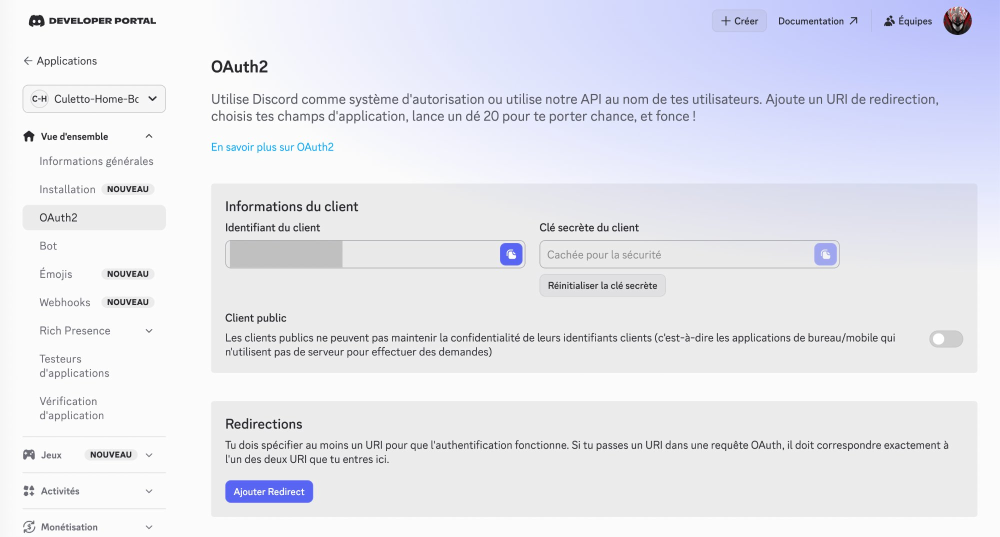

#### Partie 2 — Configurer les permissions OAuth2

Dans **OAuth2 → Générateur d'URL** :

**Champs d'application (scopes) :**
- ✅ `bot`
- ✅ `applications.commands`

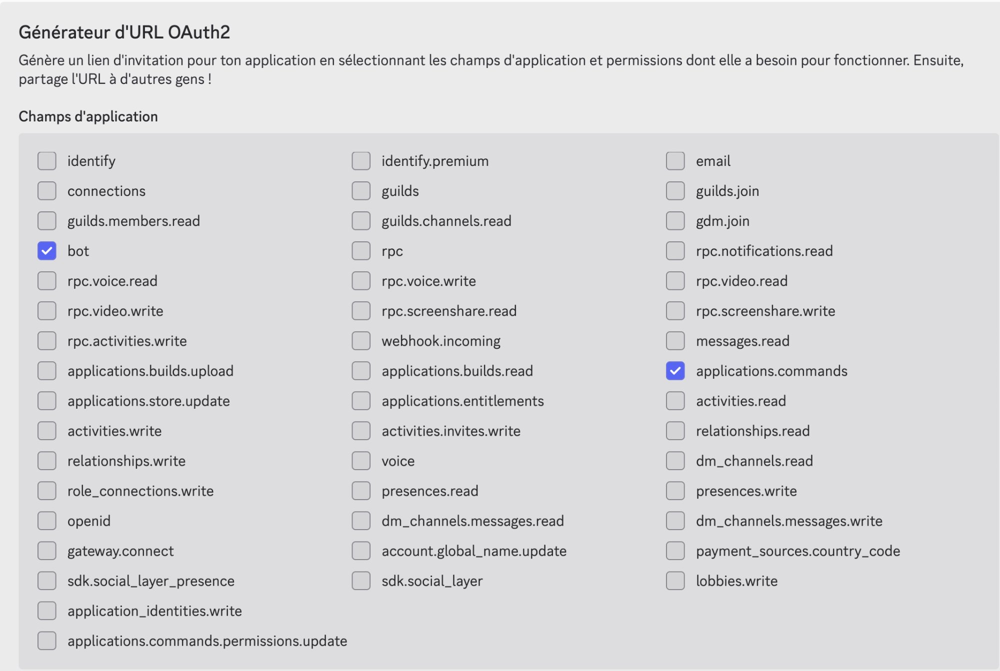

**Permissions du bot :**
- ✅ Envoyer des messages
- ✅ Intégrer des liens
- ✅ Voir les anciens messages

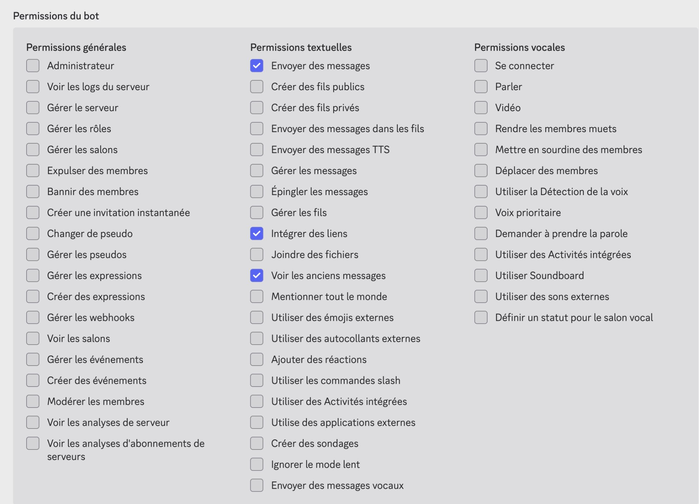

Copier l'**URL générée** pour inviter le bot sur le serveur.

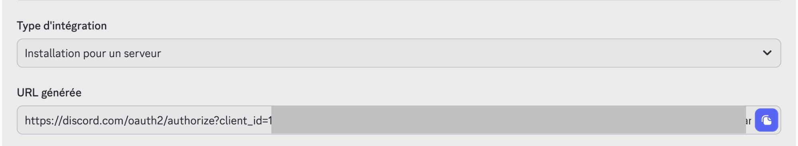

#### Partie 3 — Créer le serveur Discord et inviter le bot

1. Dans Discord, cliquer sur **"+"** → **"Créer le mien"**

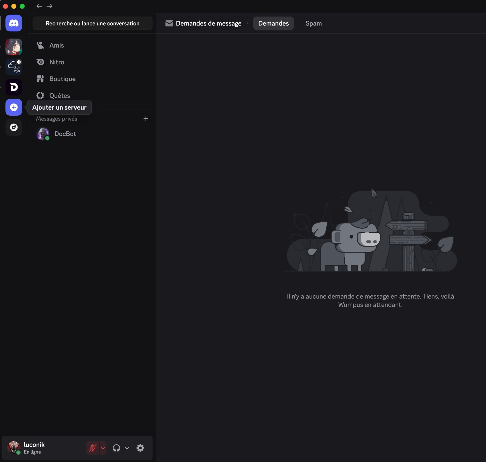

2. Choisir le type de serveur

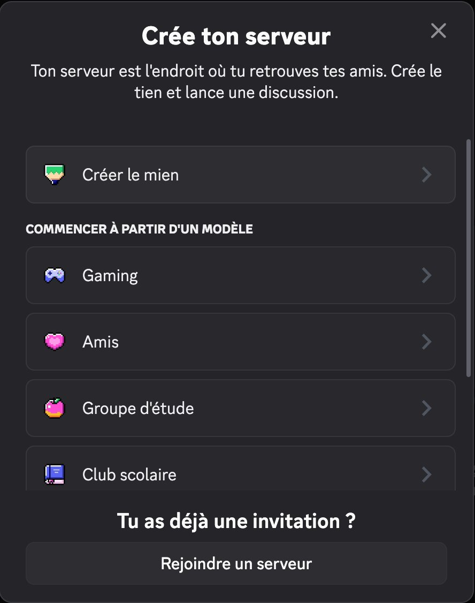

3. Ouvrir l'URL OAuth2 générée → sélectionner le serveur → **Continuer**

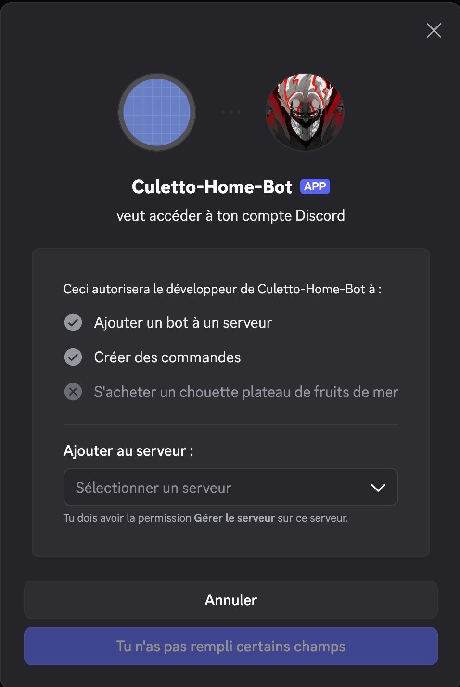

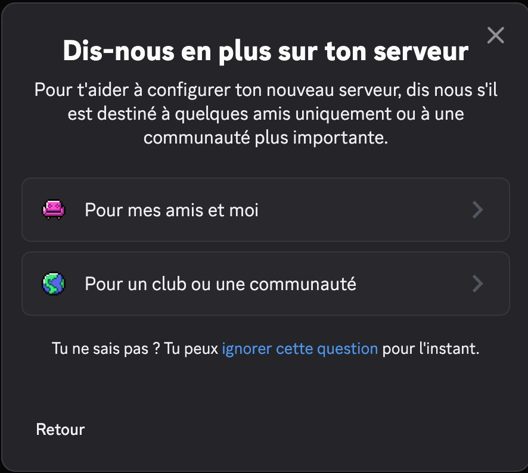

4. Confirmer les permissions → **Autoriser**

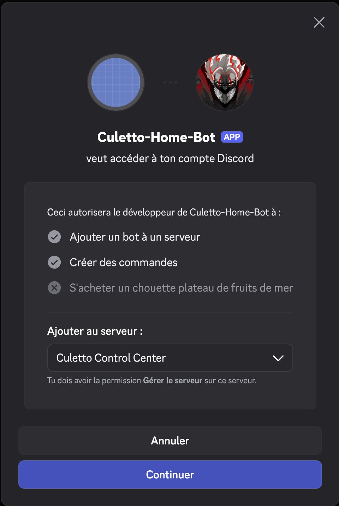

5. Le bot est ajouté avec succès ✅

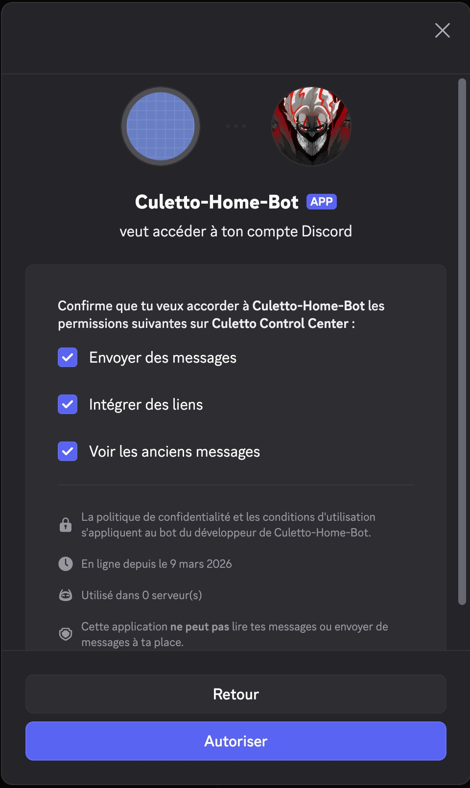

#### Partie 4 — Installer le node Discord dans n8n

Dans n8n → **Settings → Community Nodes → Install** :

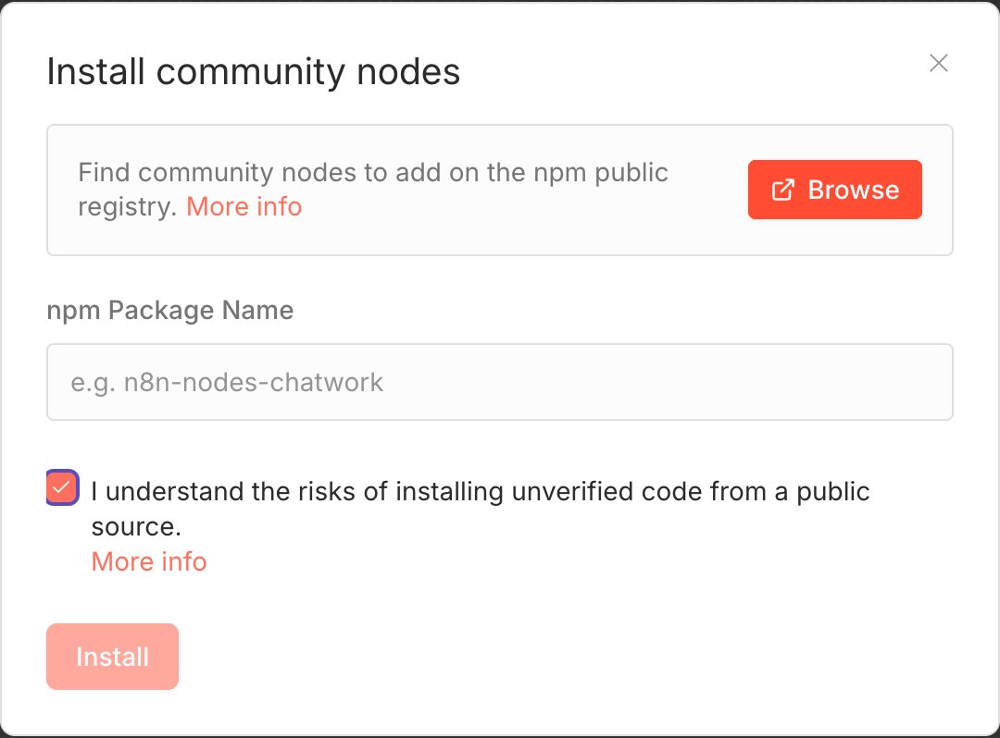

Saisir `n8n-nodes-discord-trigger` et cliquer **Install**.

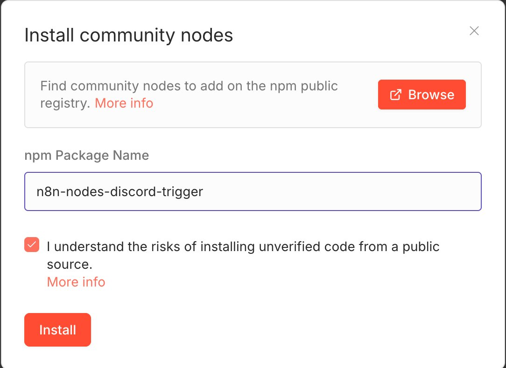

#### Partie 5 — Configurer le Discord Trigger dans n8n

Dans un workflow, ajouter le node **Discord Trigger** :

- **Credential** : Discord Bot Trigger account (Token du bot)
- **Trigger Type** : Message
- **Pattern** : Starts With
- **Value** : `!dl` (ou la commande souhaitée)

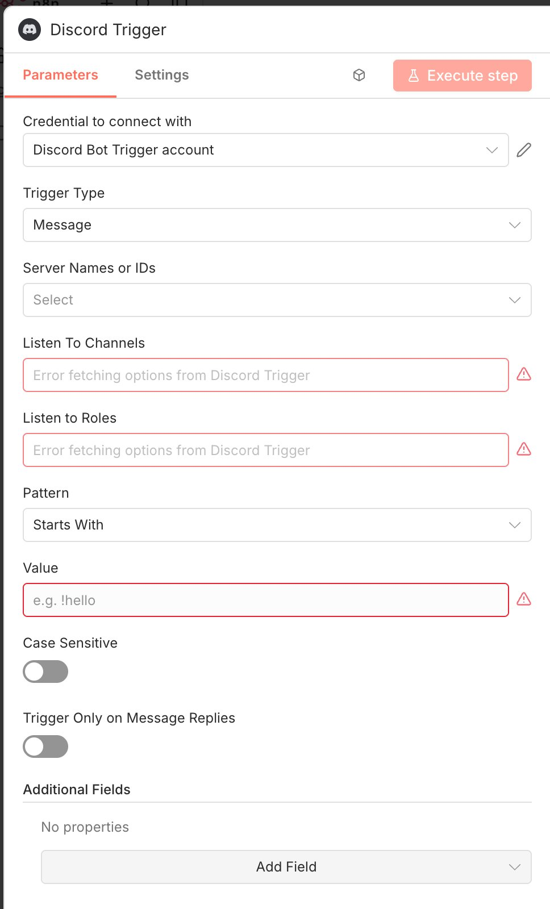

#### Variables d'environnement — Token Discord

Le token du bot Discord est à ajouter dans les credentials n8n (interface web), **pas** dans le `.env`. Il se récupère dans le **Discord Developer Portal → Bot → Token**.

> ⚠️ Ne jamais exposer le token Discord dans le code ou dans Git.

---

### Commandes utiles

```bash
# Redémarrer n8n uniquement
docker compose restart n8n

# Voir les logs en temps réel
docker compose logs -f n8n

# Accéder au shell du conteneur n8n
docker compose exec n8n sh

# Accéder à PostgreSQL
docker compose exec postgres psql -U n8n_user -d n8n

# Mise à jour de n8n
docker compose pull n8n
docker compose up -d n8n

# Backup PostgreSQL
docker compose exec postgres pg_dump -U n8n_user n8n > backup_n8n_$(date +%Y%m%d).sql
```

---

### Notes importantes

> ⚠️ **Code nodes** : ce déploiement utilise une image n8n standard. Le runtime Python n'est pas disponible dans les Code nodes — utiliser **JavaScript** uniquement.

> ⚠️ **Variables d'environnement booléennes** : toujours entre guillemets dans docker-compose (ex. `N8N_RUNNERS_ENABLED: "true"`).

> 💡 **Apostrophes dans les titres** : les titres anime contenant des apostrophes peuvent provoquer des erreurs SQL — penser à échapper les chaînes dans les Code nodes JS.

---

### Références

- [Documentation officielle n8n](https://docs.n8n.io)
- [n8n Docker Hub](https://hub.docker.com/r/n8nio/n8n)
- [`../nginx-proxy-manager/`](../nginx-proxy-manager/) — Configuration du reverse proxy

---
---

<a name="en"></a>
## 🇬🇧 English

### Overview

[n8n](https://n8n.io) is a self-hostable open-source workflow automation platform for connecting APIs, services, and tools visually.

In this homelab, n8n is used for:

- 🤖 **Discord bot** (`Culetto-Home-Bot`) — commands `!dl`, `!skip`, `!status`, `!newseason`
- 📡 **Nyaa RSS notifications** — automated tracking of VOSTFR anime/manga releases
- 🌊 **qBittorrent** — triggering and monitoring downloads via Synology NAS (`192.168.x.x`)

---

### Stack

| Component | Detail |
|-----------|--------|
| **Host** | `automation.your-domain.com` — Ubuntu Server VM on Proxmox |
| **Runtime** | Docker + Docker Compose |
| **Database** | PostgreSQL 15 (dedicated container, same stack) |
| **Reverse proxy** | Nginx Proxy Manager → `n8n.your-domain.com` (HTTPS) |
| **Webhooks** | Exposed via NPM + Cloudflare WAF |

---

### Prerequisites

- Docker + Docker Compose installed on the host
- Nginx Proxy Manager running (see [`../nginx-proxy-manager/`](../nginx-proxy-manager/))
- DNS entry `n8n.your-domain.com` pointing to the VM IP

---

### Deployment

```bash
# 1. Navigate to the folder
cd ~/homelab-setup/docker/n8n

# 2. Create the environment file
cp .env.example .env
nano .env   # fill in secrets

# 3. Start the stack
docker compose up -d

# 4. Check containers
docker compose ps
docker compose logs -f n8n
```

---

### Active workflows

| Workflow | Trigger | Description |
|----------|---------|-------------|
| `Nyaa Notify` | RSS polling (30 min) | Checks new releases on Nyaa.si and notifies Discord |
| `!dl` | Discord webhook | Manual download trigger via qBittorrent on Synology NAS |
| `!skip` | Discord webhook | Skips a pending RSS entry |
| `!status` | Discord webhook | Shows active download status |
| `!newseason` | Discord webhook | Resets the seasonal tracking list |

---

### Discord Bot — Culetto-Home-Bot

`Culetto-Home-Bot` is the Discord command interface for n8n workflows, hosted on the **Culetto Control Center** Discord server using the `n8n-nodes-discord-trigger` community node.

#### Architecture

```
Discord (Culetto Control Center)
    │
    │ Message "!dl <url>" / "!status" / ...
    ▼
n8n-nodes-discord-trigger (community node)
    │
    │ Triggers the corresponding workflow
    ▼
n8n Workflow
    │
    ├── qBittorrent API (Synology NAS)
    └── Discord reply (embed)
```

#### Supported commands

| Command | Description |
|---------|-------------|
| `!dl <url>` | Triggers a torrent download via qBittorrent |
| `!skip` | Skips the next pending RSS entry |
| `!status` | Shows active download status |
| `!newseason` | Resets the current season tracking list |

#### Part 1 — Create the Discord application

1. Go to [discord.com/developers/applications](https://discord.com/developers/applications)
2. Click **"+ New Application"** → name it (`Culetto-Home-Bot`)
3. In **OAuth2**: note the **Client ID** and generate the **Client Secret**

Screenshots: see FR section above.

#### Part 2 — OAuth2 scopes and bot permissions

**Scopes:** `bot` + `applications.commands`  
**Bot permissions:** Send Messages, Embed Links, Read Message History

Copy the generated URL to invite the bot to your server.

#### Part 3 — Create Discord server and invite the bot

Open the OAuth2 URL → select the server → Continue → Authorize.

#### Part 4 — Install Discord node in n8n

**n8n → Settings → Community Nodes → Install** → `n8n-nodes-discord-trigger`

#### Part 5 — Configure Discord Trigger node

- **Credential**: Discord Bot Trigger account (Bot Token)
- **Trigger Type**: Message
- **Pattern**: Starts With
- **Value**: `!dl` (or the desired command)

#### Discord Bot Token

The bot token is configured in n8n credentials (web UI), **not** in the `.env` file.  
Retrieve it from **Discord Developer Portal → Bot → Token**.

> ⚠️ Never expose the Discord token in code or Git.

---

### Key notes

> ⚠️ **Code nodes**: Python is unavailable in this deployment — use **JavaScript only**.

> ⚠️ **Boolean env vars**: always quote them in docker-compose (e.g. `N8N_RUNNERS_ENABLED: "true"`).

> 💡 **Apostrophes in titles**: anime titles with apostrophes can cause SQL errors — always escape strings in JS Code nodes.

---

### Useful commands

```bash
# Restart n8n only
docker compose restart n8n

# Follow logs
docker compose logs -f n8n

# Update n8n
docker compose pull n8n && docker compose up -d n8n

# PostgreSQL backup
docker compose exec postgres pg_dump -U n8n_user n8n > backup_n8n_$(date +%Y%m%d).sql
```

---

### References

- [n8n official docs](https://docs.n8n.io)
- [n8n Docker Hub](https://hub.docker.com/r/n8nio/n8n)
- [`../nginx-proxy-manager/`](../nginx-proxy-manager/) — Reverse proxy setup

---

## File structure / Structure des fichiers

```
docker/n8n/
├── README.md                                    ← This file / Ce fichier
├── docker-compose.yml
├── .env.example
└── screenshots/
    ├── discord-bot-oauth2.png
    ├── discord-bot-scopes.png
    ├── discord-bot-permissions.png
    ├── discord-bot-url-generated.png
    ├── discord-server-create.png
    ├── discord-server-type.png
    ├── discord-bot-invite-empty.png
    ├── discord-bot-invite-server.png
    ├── discord-bot-authorize.png
    ├── discord-bot-success.png
    ├── n8n-community-nodes-empty.png
    ├── n8n-community-nodes-discord-trigger.png
    └── n8n-discord-trigger-config.png
```

---

*Last updated: March 2026 — [@Luconik](https://github.com/Luconik)*
