# HPE Networking Support Portal — Compte gratuit & OVA AOS-CX pour EVE-NG
# HPE Networking Support Portal — Free Account & AOS-CX OVA for EVE-NG

> 🇫🇷 [Français](#fr) | 🇬🇧 [English](#en)

---

<a name="fr"></a>
## 🇫🇷 Français

### Objectif

Ce guide explique comment créer un compte gratuit sur le **HPE Networking Support Portal (NSP)** afin de télécharger le simulateur virtuel **AOS-CX Switch Simulator** (fichier `.ova`) utilisé dans les labs EVE-NG.

> 📎 Ce fichier OVA est utilisé dans les labs EVE-NG documentés dans [`eve-ng/`](../../).

---

### Prérequis

- Une adresse e-mail **professionnelle ou personnalisée** (domaine propre, ex. `@culetto.fr`)  
  ⚠️ Les adresses Gmail, Yahoo, Outlook, etc. ne sont **pas acceptées**
- Un navigateur web moderne

---

### Étape 1 — Accéder au portail et créer un compte

1. Aller sur [https://networkingsupport.hpe.com](https://networkingsupport.hpe.com)
2. Cliquer sur **"Créer un compte"**

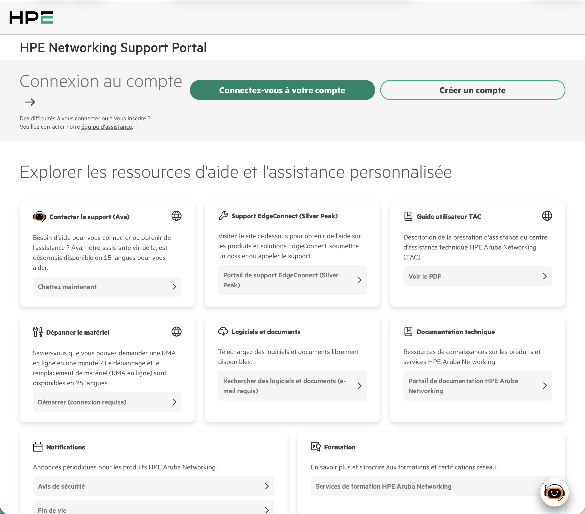

---

### Étape 2 — Démarrer l'onboarding (6 étapes)

Le processus d'inscription NSP se déroule en **6 étapes** :

| # | Étape | Description |
|---|-------|-------------|
| 1 | **Start** | Introduction et présentation des étapes |
| 2 | **Email Validation** | Vérification de l'adresse e-mail via lien d'activation |
| 3 | **Select Primary Account** | Sélection ou création d'un compte organisation |
| 4 | **Company Validation** | Validation des informations de l'entreprise |
| 5 | **User Information** | Adresse personnelle + acceptation EULA |
| 6 | **End** | Confirmation d'onboarding terminé |

Cliquer sur **"Start Onboarding"** pour commencer.

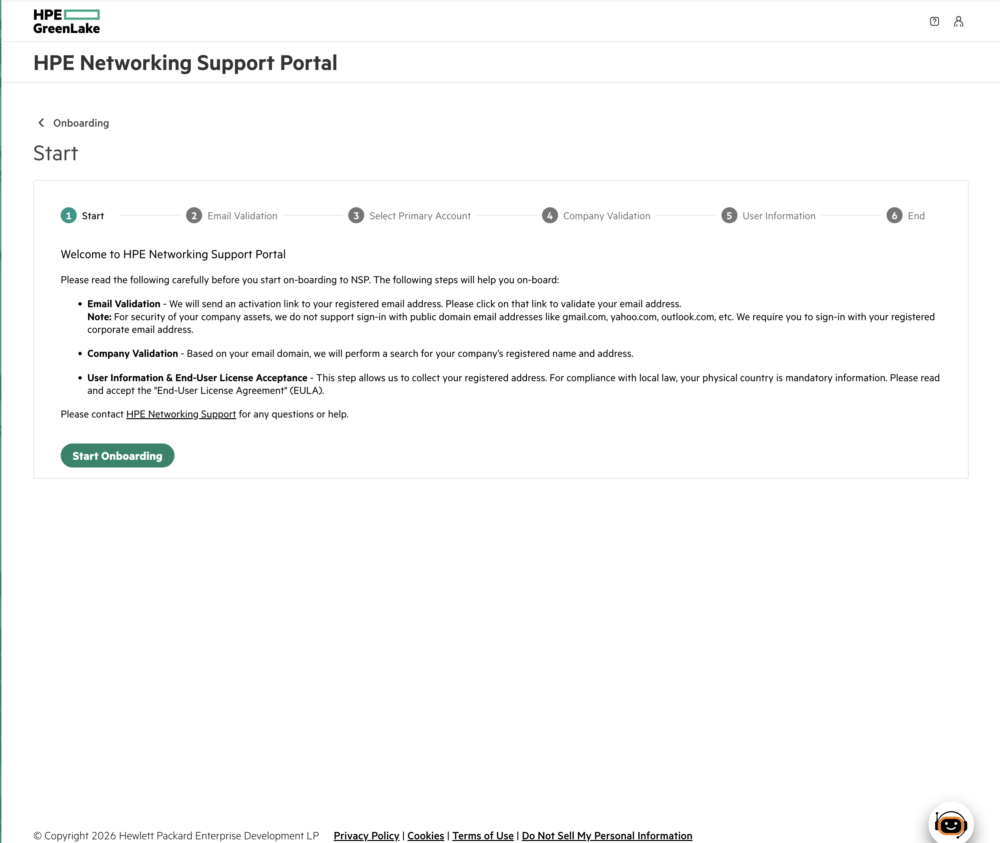

---

### Étape 3 — Validation de l'e-mail

Un e-mail de vérification est envoyé à l'adresse renseignée. Le lien est valable **6 heures**.

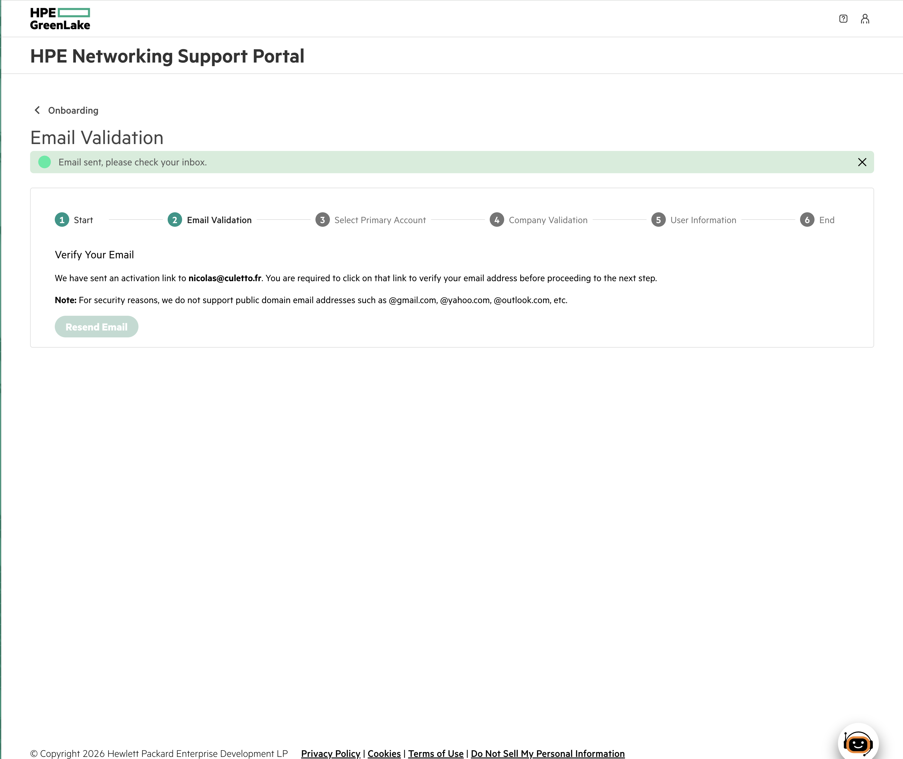

Cliquer sur le lien reçu par e-mail (objet : *HPE Networking Support Portal Email Verification*).

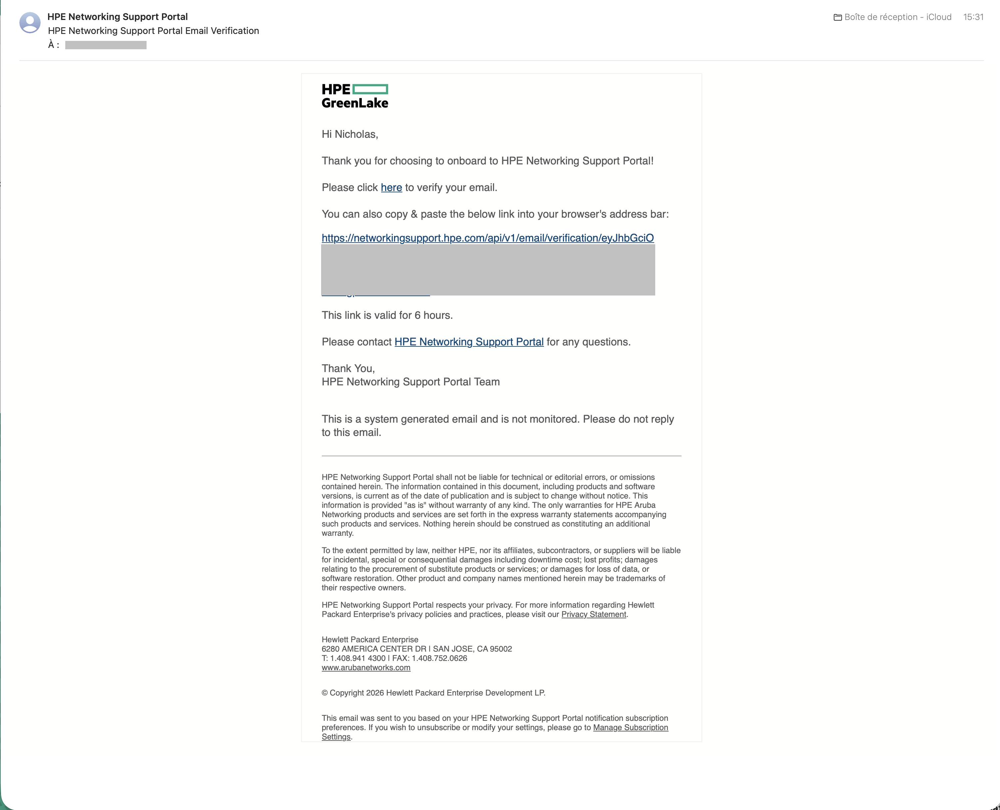

Une fois le lien cliqué, la page affiche **"Verified! Your email is now validated."**

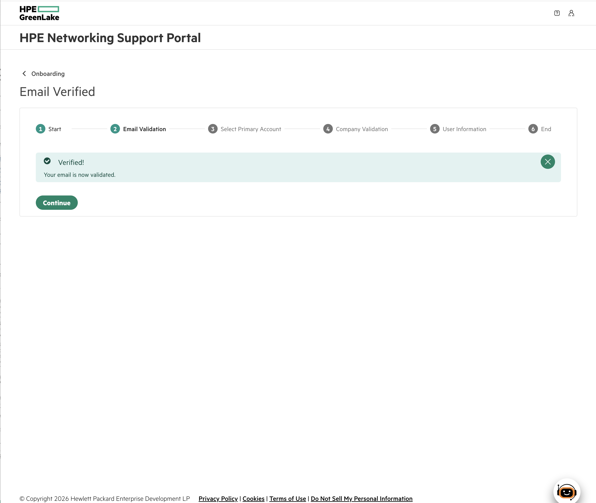

Cliquer sur **Continue**.

---

### Étape 4 — Sélectionner ou créer un compte organisation

Le portail recherche les comptes existants associés à votre domaine e-mail.  
Si aucun compte ne correspond, cliquer sur **"Create"** pour en créer un nouveau.

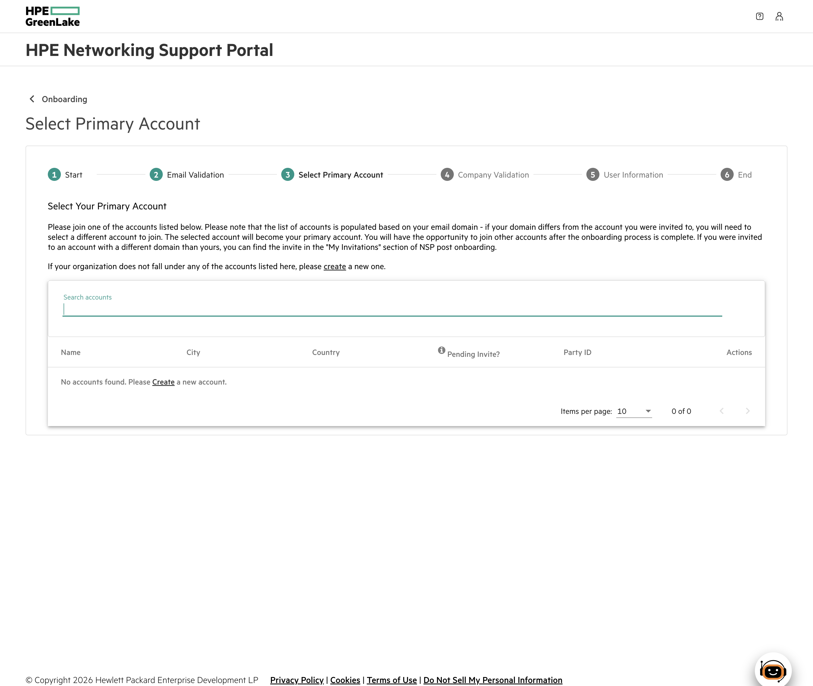

Renseigner un **Display Name** (ex. `Luconik`) et une description, puis cliquer sur **Create**.

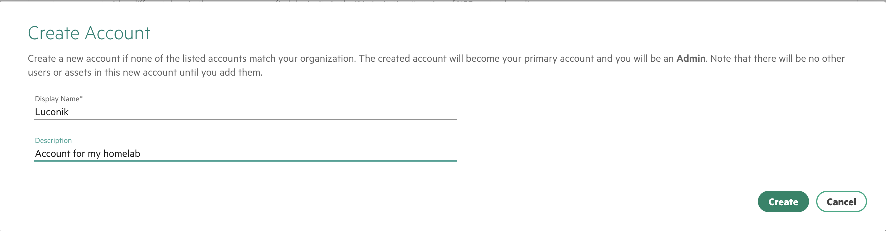

---

### Étape 5 — Validation de l'entreprise

Les informations de l'organisation sont pré-remplies à partir du domaine e-mail.  
Vérifier et compléter les champs (Company Name, Country, City, Postal Code, Address), puis cliquer sur **Create**.

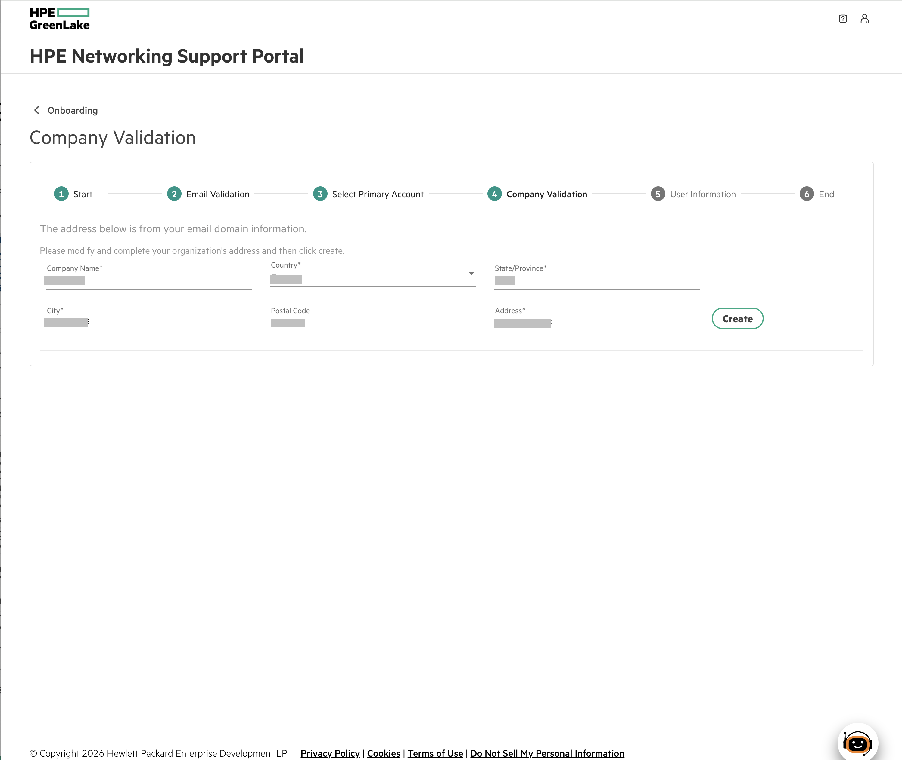

---

### Étape 6 — Informations utilisateur & EULA

Renseigner l'adresse postale, le nom d'utilisateur affiché (ex. `Luconik`), et accepter le **End-User License Agreement**.  
Cliquer sur **Next**.

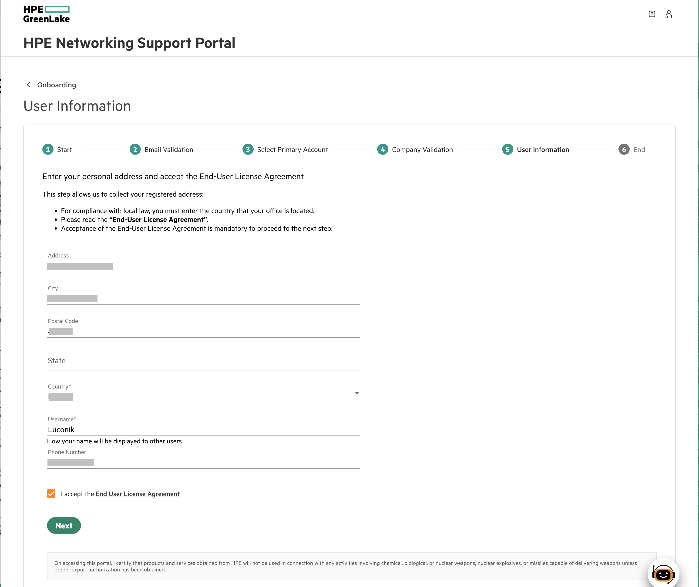

---

### Étape 7 — Onboarding terminé

La page **"On-board Completed!"** confirme la création du compte.

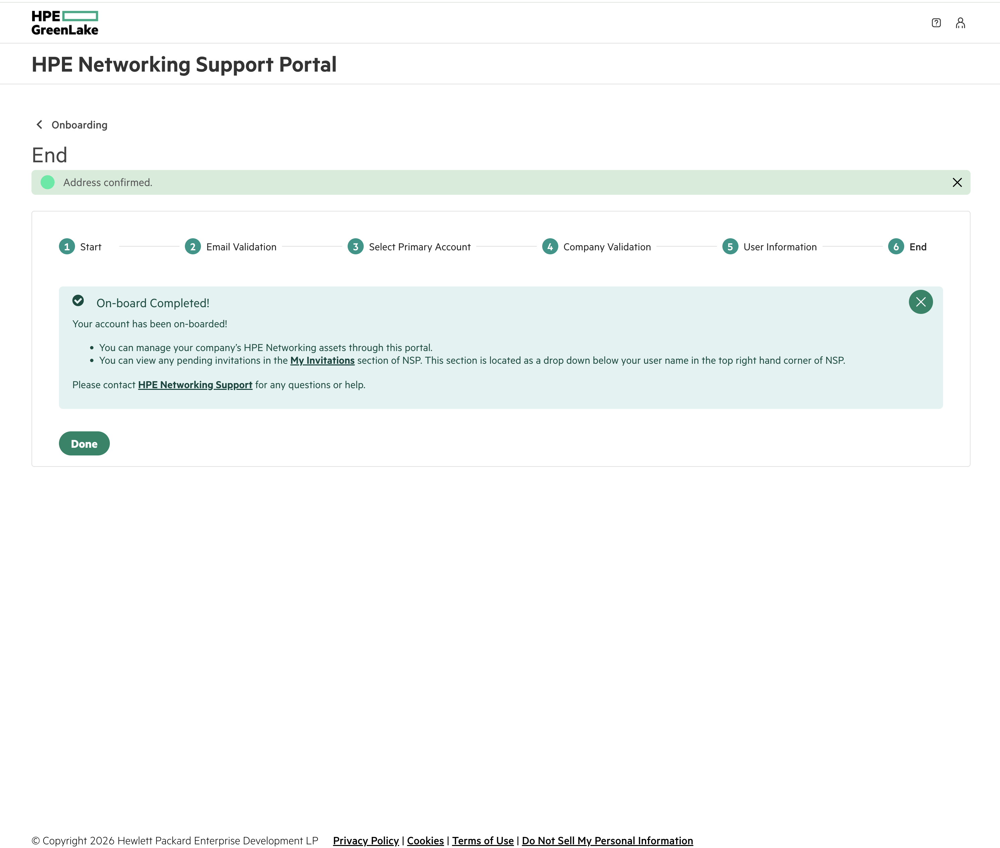

---

### Télécharger l'OVA AOS-CX

Une fois connecté au portail, depuis le dashboard principal :

1. Dans le champ de recherche, saisir **`ova`** et filtrer sur **Software**
2. Rechercher **`AOS-CX_Switch_Simulator`**
3. Sélectionner la version souhaitée (ex. `AOS-CX_Switch_Simulator_10.16.1006.ova` — dernière version GA disponible)
4. Cliquer sur l'icône de téléchargement ⬇️

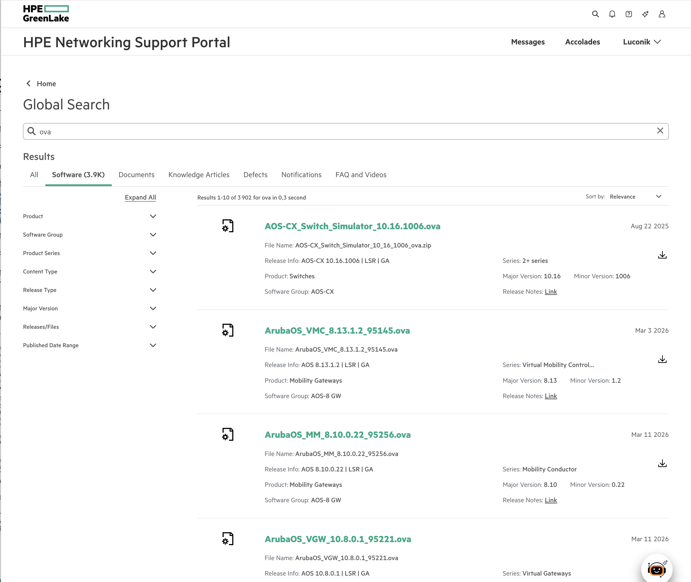

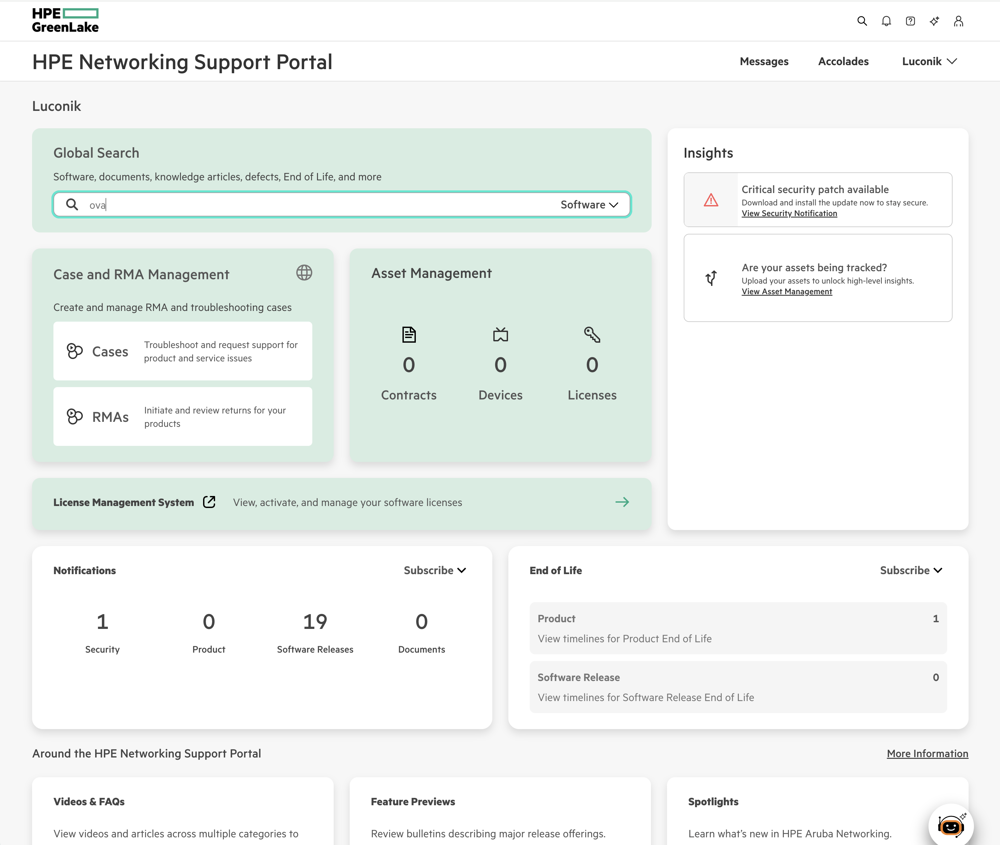

> 💡 **Fichier à télécharger :** `AOS-CX_Switch_Simulator_10.16.1006.ova`  
> Taille approximative : ~1 GB  
> Série : 2+ series | Release : AOS-CX 10.16.1006 | LSR | GA

---

### Utilisation dans EVE-NG

Une fois l'OVA téléchargé, se référer à la documentation EVE-NG :

👉 [`eve-ng/`](../../)

---
---

<a name="en"></a>
## 🇬🇧 English

### Purpose

This guide explains how to create a free account on the **HPE Networking Support Portal (NSP)** in order to download the **AOS-CX Switch Simulator** virtual appliance (`.ova` file) used in EVE-NG labs.

> 📎 This OVA is used in the EVE-NG labs documented in [`eve-ng/`](../../).

---

### Prerequisites

- A **professional or custom-domain** email address (e.g. `@culetto.fr`)  
  ⚠️ Public email providers (Gmail, Yahoo, Outlook, etc.) are **not accepted**
- A modern web browser

---

### Step 1 — Access the portal and create an account

1. Go to [https://networkingsupport.hpe.com](https://networkingsupport.hpe.com)
2. Click **"Create an account"**


---

### Step 2 — Start onboarding (6 steps)

The NSP registration process consists of **6 steps**:

| # | Step | Description |
|---|------|-------------|
| 1 | **Start** | Introduction and overview |
| 2 | **Email Validation** | Email address verification via activation link |
| 3 | **Select Primary Account** | Select or create an organization account |
| 4 | **Company Validation** | Validate company information |
| 5 | **User Information** | Personal address + EULA acceptance |
| 6 | **End** | Onboarding confirmation |

Click **"Start Onboarding"** to begin.


---

### Step 3 — Email validation

A verification email is sent to the registered address. The link is valid for **6 hours**.


Click the link in the email (subject: *HPE Networking Support Portal Email Verification*).


Once clicked, the page displays **"Verified! Your email is now validated."**


Click **Continue**.

---

### Step 4 — Select or create an organization account

The portal searches for existing accounts matching your email domain.  
If none are found, click **"Create"** to create a new one.


Enter a **Display Name** (e.g. `Luconik`) and a description, then click **Create**.


---

### Step 5 — Company validation

Organization details are pre-filled from your email domain.  
Review and complete the fields (Company Name, Country, City, Postal Code, Address), then click **Create**.


---

### Step 6 — User information & EULA

Enter your postal address, display username (e.g. `Luconik`), and accept the **End-User License Agreement**.  
Click **Next**.


---

### Step 7 — Onboarding complete

The **"On-board Completed!"** page confirms the account has been created.


---

### Download the AOS-CX OVA

Once logged into the portal, from the main dashboard:

1. In the search bar, type **`ova`** and filter on **Software**
2. Search for **`AOS-CX_Switch_Simulator`**
3. Select the desired version (e.g. `AOS-CX_Switch_Simulator_10.16.1006.ova` — latest available GA release)
4. Click the download icon ⬇️


> 💡 **File to download:** `AOS-CX_Switch_Simulator_10.16.1006.ova`  
> Approximate size: ~1 GB  
> Series: 2+ series | Release: AOS-CX 10.16.1006 | LSR | GA

---

### Using in EVE-NG

Once the OVA is downloaded, refer to the EVE-NG documentation:

👉 [`eve-ng/`](../../)

---

## File structure / Structure des fichiers

```
eve-ng/aos-cx-ova/
├── README.md               ← This file / Ce fichier
└── screenshots/
    ├── NSP_account_creation.png
    ├── NSP_Start_onboarding.png
    ├── NSP_Email_validation.png
    ├── NSP_Mail_Confirmation.png
    ├── NSP_Email_verified.png
    ├── NSP_Select_Primary_Account.png
    ├── NSP_Create_Account.png
    ├── NSP_Company_Validation.png
    ├── NSP_User_Information.png
    ├── NSP_End.png
    ├── NSP_OVA_Link.png
    └── NSP_Search_OVA.png
```

---

*Last updated: March 2026 — [@Luconik](https://github.com/Luconik)*
