# EVE-NG Community sur VMware ESXi

Guide d'installation d'**EVE-NG Community Edition** sur un hôte **VMware ESXi 8.0**, incluant l'ajout des images HPE Aruba AOS-CX et Juniper vJunos.

> 🇫🇷 Documentation principale en français — un résumé en anglais est disponible dans chaque section.  
> 🇬🇧 Main documentation in French — an English summary is available in each section.

---

## Prérequis

| Élément | Configuration utilisée |
|---------|----------------------|
| Hôte | VMware ESXi 8.0 U2 |
| vCPU alloués | 12 vCPU |
| RAM allouée | 24 576 Mo (24 Go) |
| Disque | 200 Go |
| Réseau | Portgroup dédié `eve-ng` |
| ISO | EVE-NG Community 6.2.0-4 |

> 💡 Pour dimensionner correctement la VM selon tes nodes, utilise le [nodes per lab calculator](https://drive.google.com/file/d/1Rbu7KDNSNuWiv_AphWx0vCek8CKVB1WI/view) disponible dans le [EVE-NG Community Cookbook](https://www.eve-ng.net/wp-content/uploads/2020/05/EVE-Comm-BOOK-1.08-2020.pdf).

Exemple : pour 6 switches AOS-CX Simulator 10.16, le calculateur donne **24 576 Mo RAM** et **12 vCPU**.


> **EN** — Use the EVE-NG nodes per lab calculator to size your VM. For 6 AOS-CX Simulator nodes, the minimum is 24GB RAM and 12 vCPUs.

---

## Étape 1 — Préparation réseau ESXi

Avant de créer la VM, configurer un **portgroup dédié** pour EVE-NG avec les options de sécurité nécessaires.

Dans vSphere : **Réseau → Ajouter un groupe de ports**

Paramètres de sécurité obligatoires :
- ✅ **Autoriser le mode Promiscuité** : Oui
- ✅ **Autoriser les transmissions forgées** : Oui
- ✅ **Autoriser les modifications MAC** : Oui

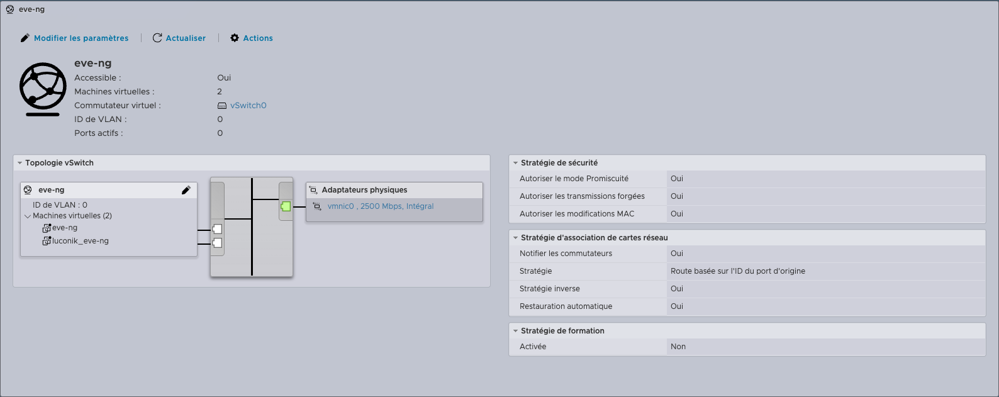

> ⚠️ Sans ces options, les nodes EVE-NG ne pourront pas communiquer entre eux.

> **EN** — Create a dedicated portgroup for EVE-NG with promiscuous mode, forged transmits, and MAC address changes all set to Accept. This is mandatory for inter-node communication.

---

## Étape 2 — Création de la VM

Depuis la console ESXi : **Machines Virtuelles → Créer/Enregistrer une machine virtuelle**

### 2.1 — Sélectionner le type de création

Choisir **"Créer une machine virtuelle"**, puis cliquer **Suivant**.

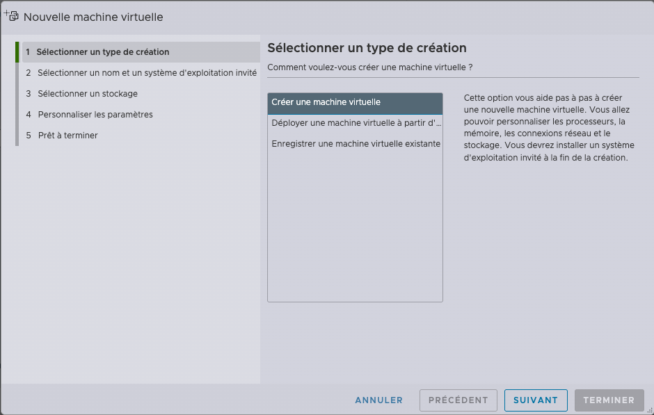

### 2.2 — Nom et système d'exploitation

- **Nom** : `luconik_eve-ng` (ou le nom de ton choix)
- **Compatibilité** : Machine virtuelle ESXi 8.0 U2
- **Famille** : Linux
- **Version SE invité** : Ubuntu Linux (64 bits)

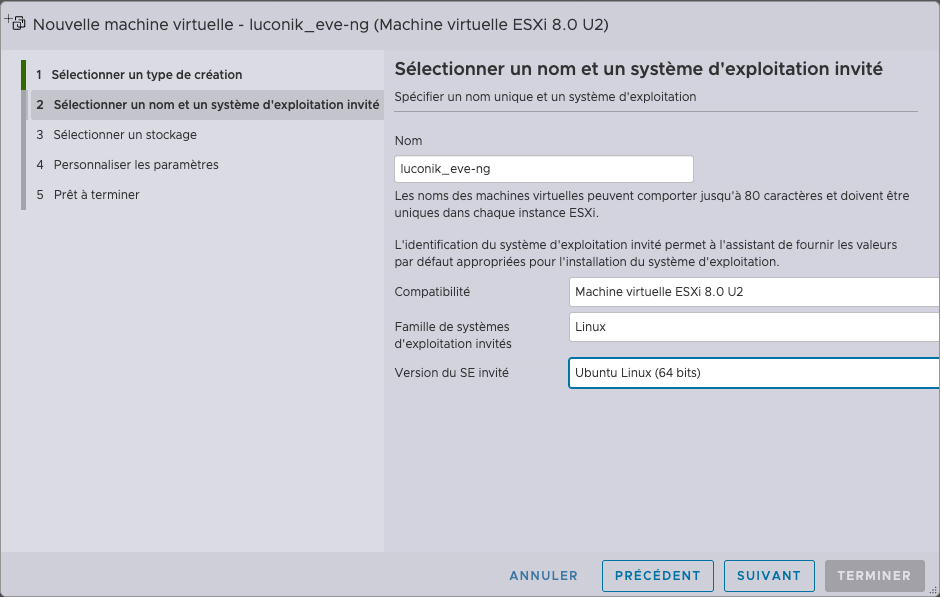

### 2.3 — Sélectionner le stockage

Choisir le datastore avec suffisamment d'espace disponible (200 Go minimum).

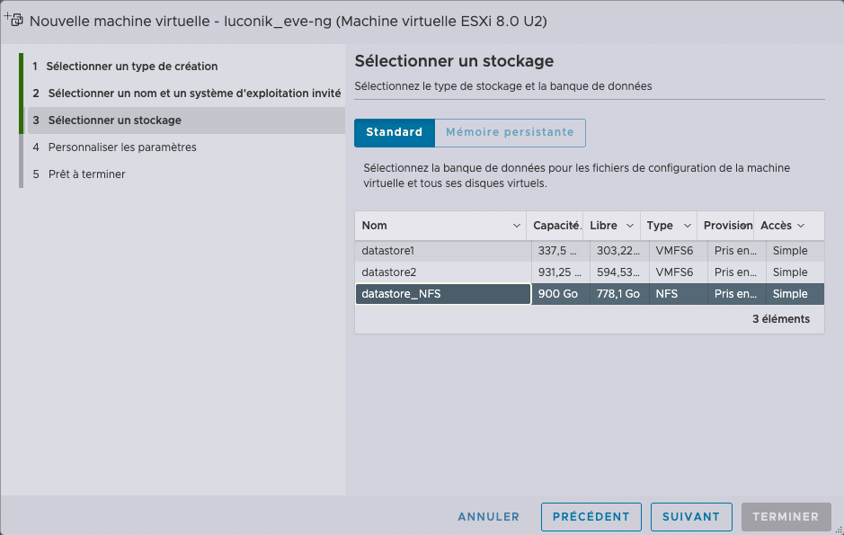

### 2.4 — Personnaliser les paramètres matériels

Configurer les ressources selon le calculateur EVE-NG :

- **CPU** : 12 vCPU
- **Mémoire** : 24 576 Mo
- **Disque dur 1** : 200 Go (VMware Paravirtual)

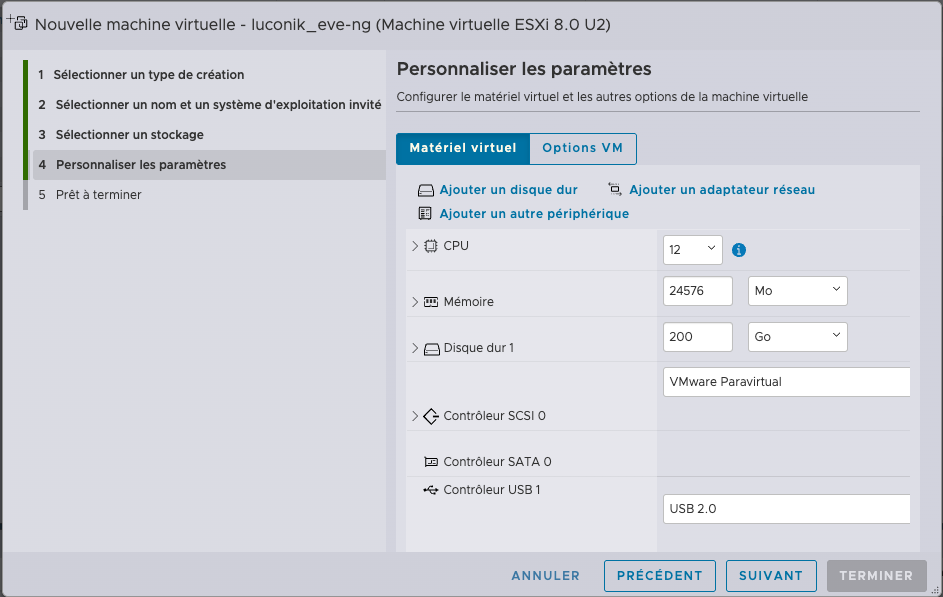

Configurer ensuite le réseau et l'ISO :

- **Adaptateur réseau 1** : portgroup `eve-ng` ✅ Connecter
- **Lecteur CD/DVD 1** : ISO EVE-NG Community ✅ Connecter

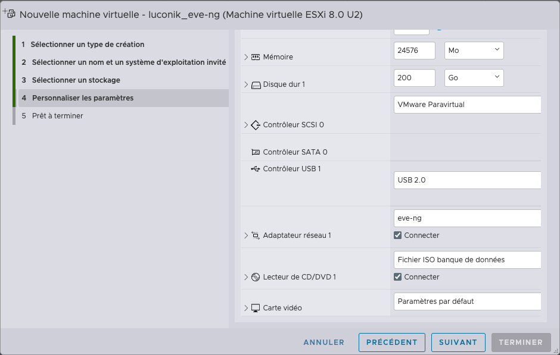

### 2.5 — Récapitulatif et finalisation

Vérifier les paramètres puis cliquer **Terminer**.

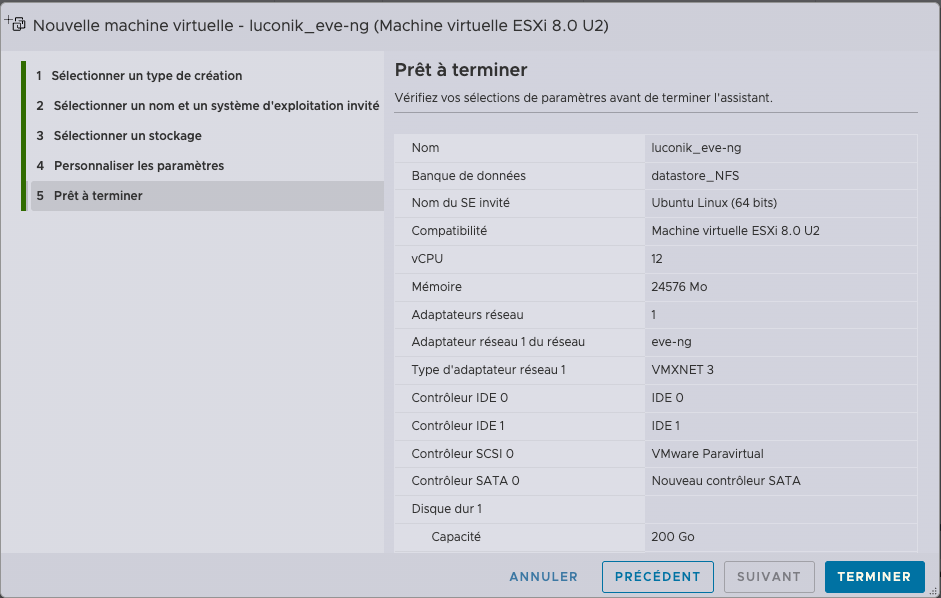

> ⚠️ **Ne pas démarrer la VM tout de suite** — il faut d'abord activer la nested virtualization (étape 3).

> **EN** — Create the VM with Ubuntu Linux (64-bit), allocate resources per the calculator, attach the eve-ng portgroup and EVE-NG ISO. Do not power on yet.

---

## Étape 3 — Activation de la Nested Virtualization

La nested virtualization permet à EVE-NG d'exécuter des VMs (AOS-CX, Juniper vJunos...) à l'intérieur de la VM ESXi. **Sans cette option, les nodes ne démarreront pas.**

1. Clic droit sur la VM → **"Modifier les paramètres"**
2. Onglet **"Matériel virtuel"** → développer **CPU**
3. Cocher ✅ **"Exposer l'assistance matérielle à la virtualisation au SE invité"**
4. Cliquer **Enregistrer**

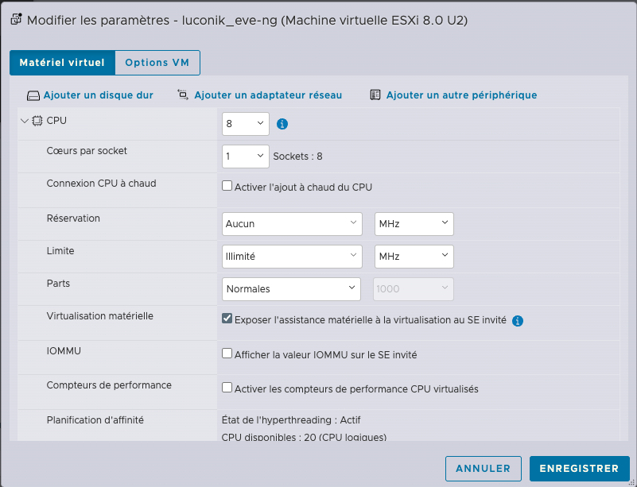

> **EN** — Enable nested virtualization by checking "Expose hardware-assisted virtualization to the guest OS" in CPU settings. Mandatory — without it, EVE-NG nodes will not start.

---

## Étape 4 — Installation d'EVE-NG

Démarrer la VM. Le GRUB EVE-NG s'affiche.

### 4.1 — Menu GRUB

Sélectionner **"Install EVE-NG Community 6.2.0-4"** et appuyer sur Entrée.

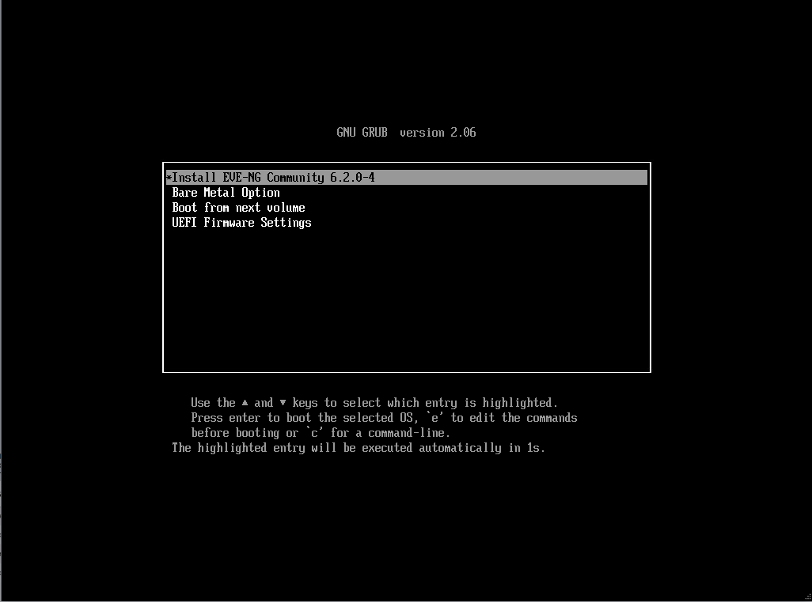

### 4.2 — Choix de la langue

Sélectionner **Français**.


### 4.3 — Configuration du clavier

- **Disposition** : French
- **Variante** : French (Macintosh) ← adapter selon ton clavier
- Cliquer **Terminé**


### 4.4 — Confirmation de l'installation

Confirmer l'action en cliquant **Continuer**.

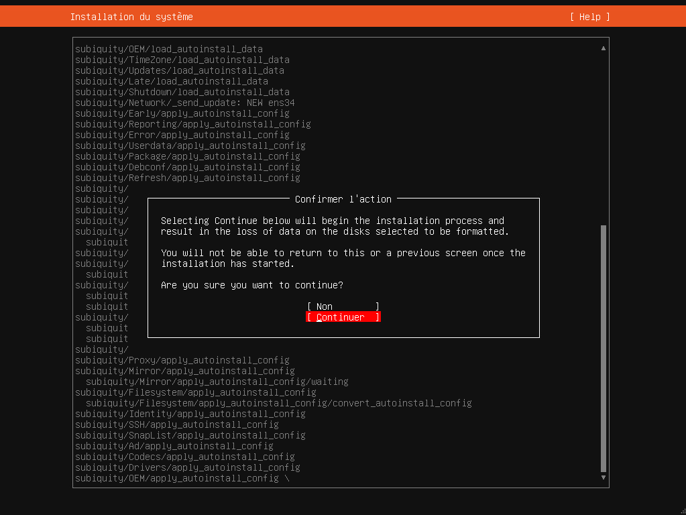

L'installation se lance. Patienter jusqu'au redémarrage automatique.

> **EN** — Select the EVE-NG Community install option, choose language and keyboard layout, confirm installation. The system reboots automatically when done.

---

## ⚠️ Problèmes connus

### Erreur "Bad shim signature"

Si ce message apparaît au démarrage :

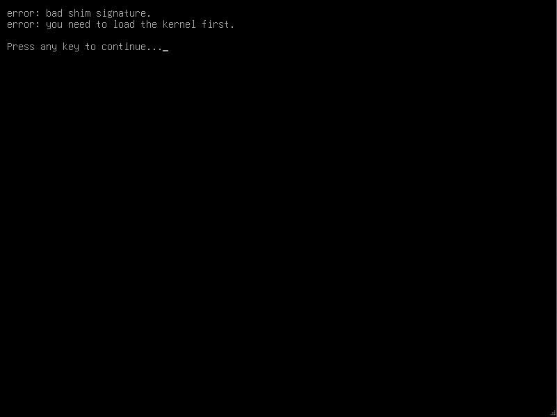

**Cause** : Le Secure Boot UEFI est activé sur la VM.

**Solution immédiate** : Depuis le GRUB → **"Advanced options for Ubuntu"** → sélectionner la version précédente du noyau.

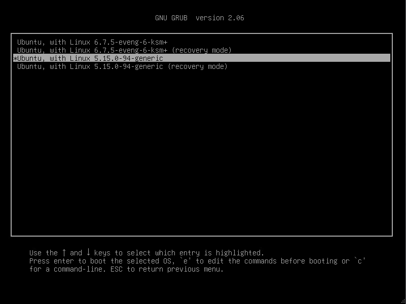

**Solution définitive** : Désactiver le Secure Boot UEFI sur la VM :
1. Clic droit sur la VM → **"Modifier les paramètres"**
2. Onglet **"Options VM"** → **"Options de démarrage"**
3. Décocher **"Activer ou non le démarrage sécurisé UEFI pour cette VM"**
4. Cliquer **Enregistrer**

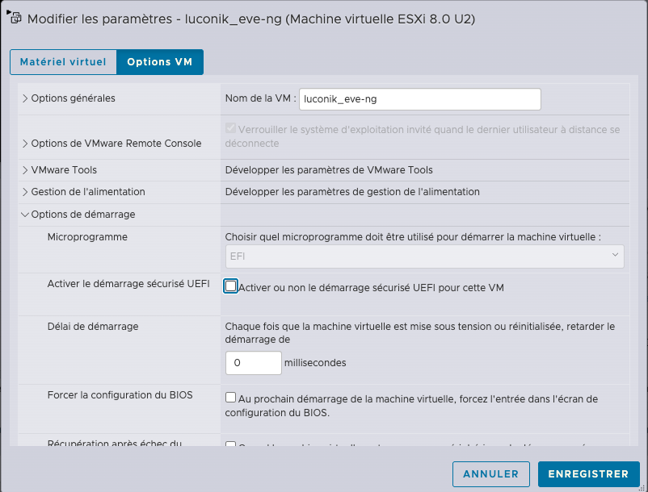

### Avertissement "Neither Intel VT-x or AMD-V found"

Si ce message apparaît au boot :

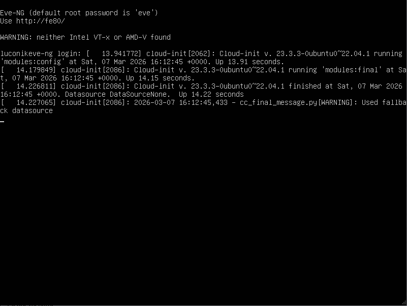

**Cause** : La nested virtualization n'est pas activée sur la VM.

**Solution** : Éteindre la VM et activer l'option décrite à l'**Étape 3**.

> **EN** — Two common issues: (1) "Bad shim signature" → disable UEFI Secure Boot; (2) "Neither Intel VT-x or AMD-V found" → enable nested virtualization in CPU settings (Step 3).

---

## Étape 5 — Configuration initiale (Setup Wizard)

Après le redémarrage, la VM affiche l'invite de login EVE-NG.


Se connecter avec :
- **Login** : `root`
- **Mot de passe** : `eve`

Le wizard de configuration se lance automatiquement.

### 5.1 — Mot de passe root

Définir un nouveau mot de passe root sécurisé.

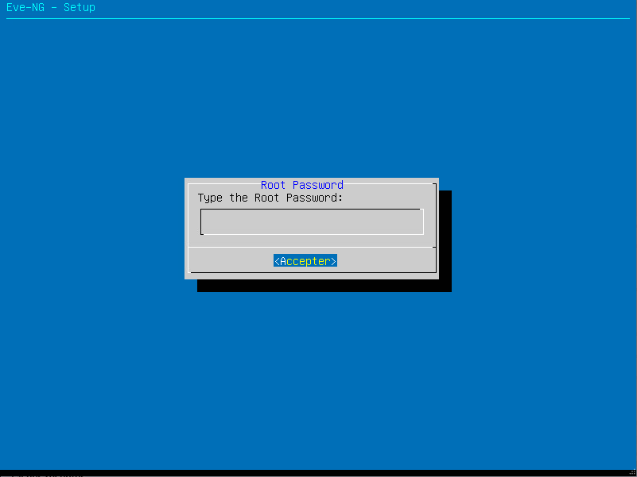

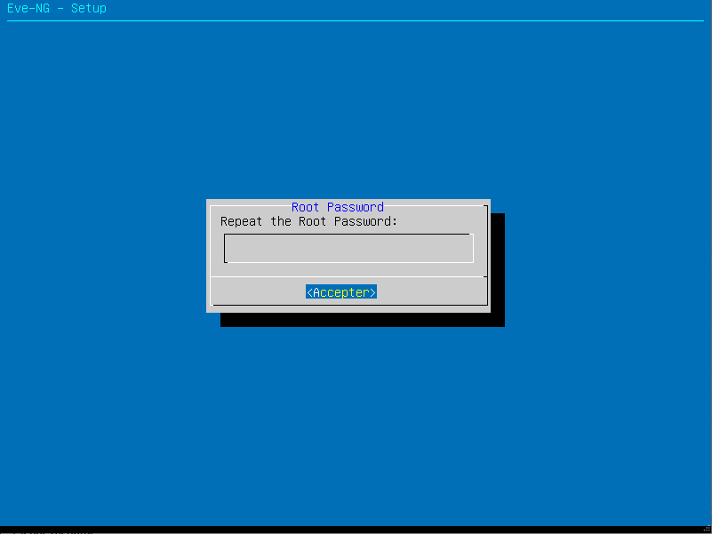

### 5.2 — Hostname

Définir le nom d'hôte de la VM (ex : `luconik_eve-ng`).


### 5.3 — Nom de domaine DNS

Renseigner le nom de domaine (ex : `luconik.fr`).


### 5.4 — Mode IP (DHCP ou Statique)

Sélectionner **static** pour une IP fixe (recommandé).


### 5.5 — Adresse IP de management

Renseigner l'IP statique de la VM sur le réseau de management.


### 5.6 — Masque de sous-réseau


### 5.7 — Passerelle par défaut

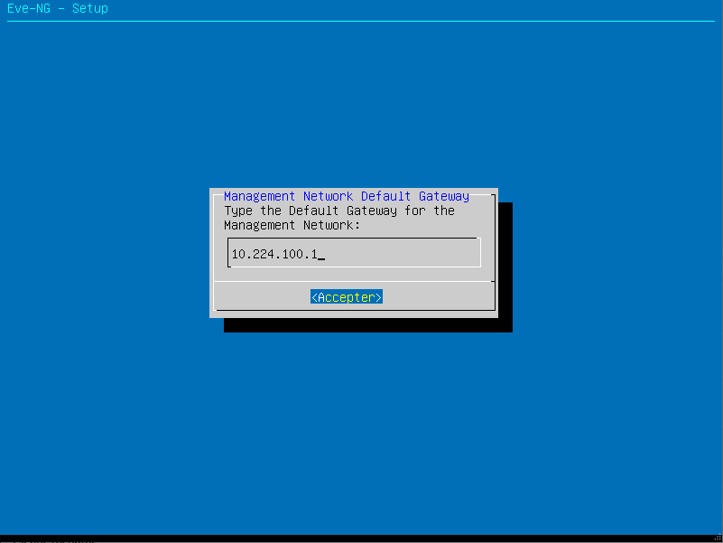

### 5.8 — DNS primaire


### 5.9 — DNS secondaire

Laisser vide si non utilisé.


### 5.10 — Serveur NTP

Renseigner un serveur NTP (ex : `0.fr.pool.ntp.org`).

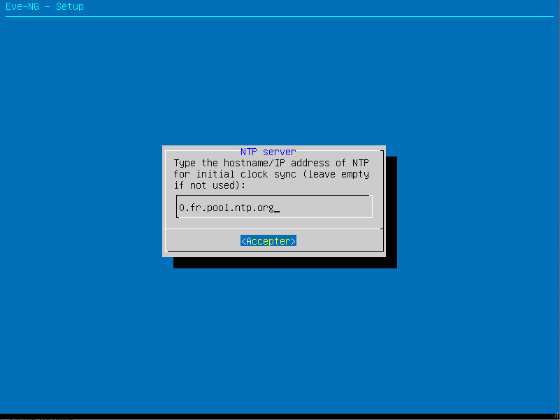

### 5.11 — Proxy

Sélectionner **"Direct connection"** si pas de proxy.


Le système redémarre avec la nouvelle configuration.

> 💡 Si le wizard a planté ou qu'un paramètre est erroné, le relancer avec :
> ```bash
> rm -f /opt/ovf/.configured && su -
> ```

> **EN** — After reboot, log in as root/eve. The setup wizard configures hostname, domain, static IP, gateway, DNS, NTP, and proxy. Use direct connection unless you have a corporate proxy.

---

## Étape 6 — Mises à jour et vérification

Se connecter en SSH ou via la console et mettre à jour le système.


```bash
apt update && apt upgrade -y
```

Vérifier que la nested virtualization est bien active :

```bash
egrep -c '(vmx|svm)' /proc/cpuinfo
# Résultat attendu : valeur > 0
```

Accéder à l'interface web depuis un navigateur :

```
http://[IP_EVE-NG]
```

Identifiants par défaut :
- **Login** : `admin`
- **Mot de passe** : `eve`

> ⚠️ Changer le mot de passe immédiatement après la première connexion.

> **EN** — Update the system with apt update && apt upgrade -y. Access the web UI at http://[EVE-NG_IP] with admin/eve. Change the password immediately.

---

## Étape 7 — Installation des images réseau

### 7.1 — HPE Aruba AOS-CX

Uploader le fichier `.ova` AOS-CX sur la VM EVE-NG (via SCP ou SFTP), puis :

```bash
# Créer un dossier de travail et extraire l'OVA
mkdir ~/aos-cx && cd ~/aos-cx
# Copier l'OVA dans ce dossier au préalable
tar xvf AOS-CX_10_15_0005.ova

# Convertir le VMDK en qcow2
/opt/qemu/bin/qemu-img convert -f vmdk -O qcow2 \
  arubaoscx-disk-image-genericx86-p4-*.vmdk virtioa.qcow2

# Créer le dossier destination et déplacer l'image
mkdir /opt/unetlab/addons/qemu/aruba_aoscx-10.15
mv virtioa.qcow2 /opt/unetlab/addons/qemu/aruba_aoscx-10.15/

# Nettoyer et corriger les permissions
cd && rm -rf ~/aos-cx
/opt/unetlab/wrappers/unl_wrapper -a fixpermissions
```

> 💡 Adapter le nom du dossier selon la version installée (ex : `aruba_aoscx-10.16`).

### 7.2 — Juniper vJunos Switch

```bash
# Créer le dossier destination
mkdir /opt/unetlab/addons/qemu/vjunosswitch-23.2R1.14
cd /opt/unetlab/addons/qemu/vjunosswitch-23.2R1.14

# Copier l'image qcow2 dans ce dossier, puis renommer
mv vJunos-switch-23.2R1.14.qcow2 virtioa.qcow2

# Corriger les permissions
/opt/unetlab/wrappers/unl_wrapper -a fixpermissions
```

### 7.3 — Juniper vJunos Evolved (EVO)

```bash
mkdir /opt/unetlab/addons/qemu/vjunosevo-23.2R2.21
cd /opt/unetlab/addons/qemu/vjunosevo-23.2R2.21

mv vJunosEvolved-23.2R2.21-EVO.qcow2 virtioa.qcow2

/opt/unetlab/wrappers/unl_wrapper -a fixpermissions
```

### 7.4 — Juniper vJunos Router

```bash
mkdir /opt/unetlab/addons/qemu/vJunos-router-23.2R1.15
cd /opt/unetlab/addons/qemu/vJunos-router-23.2R1.15

mv vJunos-router-23.2R1.15.qcow2 virtioa.qcow2

/opt/unetlab/wrappers/unl_wrapper -a fixpermissions
```

> ⚠️ **Règle impérative** : le fichier image doit toujours s'appeler `virtioa.qcow2` dans son dossier, quelle que soit la plateforme.

> **EN** — All network appliance images must be placed in `/opt/unetlab/addons/qemu/[image-folder]/` and renamed to `virtioa.qcow2`. Always run fixpermissions after adding any image. AOS-CX OVA files must first be extracted and converted from VMDK to qcow2 format.

---

## Ressources utiles

- 📖 [Documentation officielle EVE-NG](https://www.eve-ng.net/index.php/documentation/)
- 📖 [EVE-NG Community Cookbook](https://www.eve-ng.net/wp-content/uploads/2020/05/EVE-Comm-BOOK-1.08-2020.pdf)
- 🧮 [Nodes per lab calculator](https://drive.google.com/file/d/1Rbu7KDNSNuWiv_AphWx0vCek8CKVB1WI/view)
- 🔗 [Guide EVE-NG sur Proxmox](../proxmox/README.md)
- 🔗 [Repo netdevops](https://github.com/Luconik/netdevops)

---

> Les guides sont librement réutilisables avec mention de l'auteur (CC BY 4.0).
